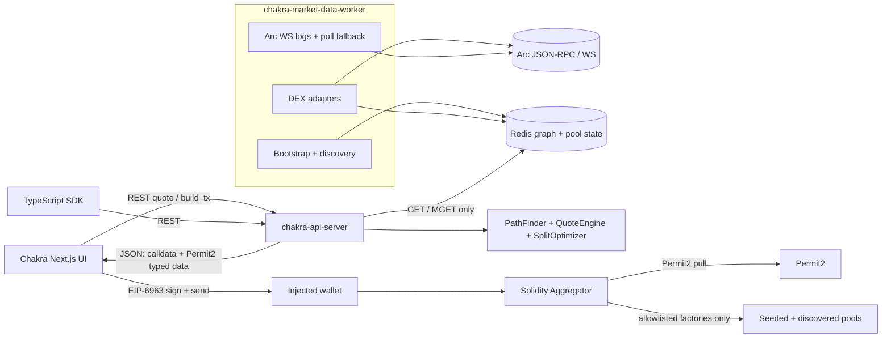
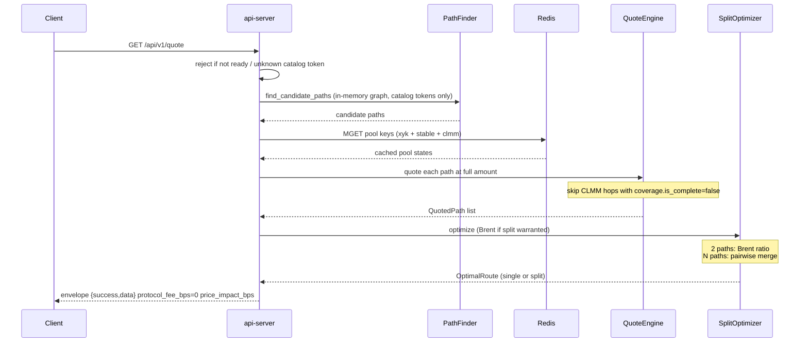
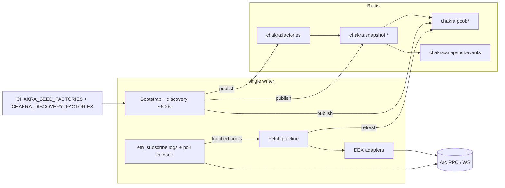

# System Design & Architecture

**Product:** Chakra (Arc testnet DEX aggregator)
**Feature key:** `chakra`
**Status:** Phase 3 **reviewed** 2026-08-20 against reviewed requirements `docs/ai/requirements/2026-08-20-feature-chakra.md`. Implementation notes belong in `dev-implementation`. Do not treat this file as permission to write product code.

Chakra ports Chakra’s routing architecture to Arc EVM. Topology (pairs, pool IDs, fees) is separate from live state (reserves / ticks). `chakra-market-data-worker` is the **single Redis writer**. `chakra-api-server` is stateless: each `/quote` reloads the last snapshot, MGETs pool state, runs PathFinder → QuoteEngine → SplitOptimizer locally, and never holds user keys. `/build_tx` is an **encoder and validator of the client’s `sub_routes`**, not a re-quoter. The API never sends a transaction; the wallet does.

## Architecture Overview

Arc-specific deltas vs Chakra README:

| Chakra (Arc) | Chakra (Arc) |
|------------------|--------------|
| Arc RPC poll 0.1 s | Arc **WebSocket logs** + short HTTP poll fallback (~0.5 s blocks, deterministic finality) |
| Arc WASM aggregator | **Solidity** `splitSwap` / multi-hop, `minAmountOut`, Permit2 `AllowanceTransfer` pull |
| wallet / unsigned XDR | wagmi/viem calldata + Permit2 EIP-712 signature |
| Classic Arc benchmark | **Dropped** (no analog). Circle App Kit Swap is **not** a routing venue |
| Dual USDC N/A | **One economic balance, two encodings:** ERC-20 USDC **6 dp** for swap amounts/balances; native USDC **18 dp** for gas only. ERC-20 `transfer`/`approve`/`transferFrom` move the native balance. No wrap/unwrap. Aggregator `msg.value` = 0 |
| Trust callee DEX contracts | **Factory allowlist** on the aggregator; hops verified `getPair` / `getPool` / stable-factory membership before any call |



### Quote request flow



### Execute flow (`build_tx` is not a re-quote)

```mermaid
sequenceDiagram
  participant U as Trader
  participant FE as UI
  participant API as api-server
  participant RPC as Arc RPC
  participant W as Wallet
  participant A as Aggregator
  participant P2 as Permit2
  participant P as Allowlisted pools

  U->>FE: Confirm swap
  FE->>API: POST /build_tx (from, tokens, amount_in, min_amount_out, sub_routes, deadline)
  API->>API: validate continuity, amount sum, catalog, known pools
  API->>RPC: paused(), ERC-20 allowance→Permit2, Permit2.allowance(user,token,aggregator)
  alt aggregator paused
    API-->>FE: 503 PAUSED
  else
    API-->>FE: calldata value=0, required_approvals, optional Permit2 typed data
  end
  opt ERC-20 allowance to Permit2 missing
    FE->>W: approve(Permit2, max or exact)
    W->>P2: ERC-20 approve
  end
  opt Permit2 allowance to aggregator insufficient
    FE->>W: sign PermitSingle EIP-712
  end
  FE->>RPC: paused() again; chainId===5042002
  FE->>W: send splitSwap maxFeePerGas≥20 gwei value=0
  W->>A: splitSwap(...)
  A->>A: deadline, not paused, msg.value==0, factory checks
  A->>P2: permit (if signature provided) + transferFrom
  A->>P: hops (V2 transfer+swap / stable exchange / V3 swap+callback)
  A->>A: amountOut ≥ minAmountOut; leftover sweep
  A->>U: tokenOut
  A-->>FE: Swap event / receipt
  FE->>FE: Arcscan link + localStorage recent-swaps row
```

### Worker write path



### Technology stack

| Layer | Choice | Rationale |
|-------|--------|-----------|
| Worker / router / API | Rust (port Chakra crates) | Keep proven PathFinder, local math, Brent splitter |
| Aggregator + seeded AMMs | Solidity + Foundry | Arc is EVM; Foundry is the Arc skill default |
| UI | Next.js App Router, Tailwind, wagmi, viem | EIP-6963, `arcTestnet` from viem, Vercel-ready |
| SDK | TypeScript | Integrator 30-minute path |
| Cache | Redis | Topology vs state; horizontally scalable API |
| Browser QA | Playwright CLI + MetaMask / dAppwright harness | User rule: no Playwright MCP |
| Solidity compiler | `0.8.30`, Foundry `evm_version = prague` | Matches Arc deploy tutorial and Arc EVM target |

### Arc Canteen source audit (Phase 3 addendum)

The first Phase 3 pass used `AGENTS.md` plus `use-arc`, `use-usdc`, `contract-addresses.md`, and `gas-and-fees.md`. This addendum walks the **full** `~/.arc-canteen/context/AGENTS.md` index (skills table, docs layout, Circle `llms.txt`, Arc `llms.txt`, and `samples/` READMEs). Every path is either applied below or explicitly out of v1.

Circle’s Arc `llms.txt` instruction “use App Kit for bridging, swaps, and unified balance” is **overridden** by locked Q&A: Chakra is a self-hosted aggregator, not an App Kit wrap.

**Applied (change implementation)**

| Source | Lock |
|--------|------|
| `AGENTS.md` | Operator keys **only** in `~/.arc-canteen/wallet.yaml` (mode 0600). Canteen `$RPC` in `~/.arc-canteen/env` is an **authenticated, method-allowlisted proxy** (`rpc.testnet.arc-node.thecanteenapp.com`). It allows read-mostly Eth RPC + `eth_sendRawTransaction` and **does not** expose `eth_subscribe`. **Never** point worker or API at `$RPC`. Operator may use `$RPC` + `cast` for one-off deploys. `arc-canteen login` / `wallet` / `rotate-rpc-key` / `submit-showcase` are operator CLI, not product. |
| `circlefin-skills/use-arc.md` | Chain `5042002` / `0x4CEF52`; RPC `https://rpc.testnet.arc.io`; WS `wss://rpc.testnet.arc.io`; explorer `https://testnet.arcscan.app`; faucet `https://faucet.circle.com`; CCTP domain **26** (do not call TokenMessenger). viem **`arcTestnet` built-in** (no custom chain object). Foundry deploy. **Never target mainnet.** Never pass `--private-key` as a CLI flag in testnet/staging/CI — use Foundry scripts + env/keystore (`cast wallet import`). Tutorial `forge create --private-key` is local-demo only. |
| `circlefin-skills/use-usdc.md` | ERC-20 USDC **always 6 dp**; never 18 dp for swap amounts. Arc duality: native gas 18 dp vs ERC-20 6 dp, same underlying balance. DeFi uses ERC-20 only. Circle “never hardcode USDC” is satisfied by **freezing** the Arc testnet addresses from `contract-addresses.md` into the v1 catalog (not by a live Circle API lookup). |
| `developers.circle.com/stablecoins/{usdc,eurc}-contract-addresses.md` | Same addresses as Arc contract-addresses: USDC `0x3600…0000`, EURC `0x89B5…D72a`. |
| `arc/references/connect-to-arc.md` (duplicate: `integrate/connect-to-arc.md`) | `wallet_addEthereumChain` `nativeCurrency` USDC 18 dp; EIP-6963 announce/request; wallets that lack custom gas tokens **may display native as ETH** — UI still labels USDC. HTTP failovers **with documented public URLs:** Blockdaemon, dRPC, QuickNode. WS failovers: dRPC, QuickNode. **Alchemy is a named partner with no public URL in this doc — do not invent one.** |
| `arc/references/gas-and-fees.md` | Min base fee **20 gwei**; `maxFeePerGas ≥ 20 gwei`; fetch `eth_gasPrice` or `eth_feeHistory`; gas tracker `https://testnet.arcscan.app/gas-tracker`. Native gas 18 dp. |
| `arc/references/contract-addresses.md` | USDC / EURC / Permit2 / Multicall3 / CREATE2 used. Do **not** call or allowlist: USYC `0xe9185F0c5F296Ed1797AaE4238D26CCaBEadb86C`, Entitlements `0xcc205224862c7641930c87679e98999d23c26113`, Teller `0x9fdF14c5B14173D74C08Af27AebFf39240dC105A`, CCTP V2 suite (TokenMessengerV2 `0x8FE6B999Dc680CcFDD5Bf7EB0974218be2542DAA` domain 26, plus MessageTransmitterV2 / TokenMinterV2 / MessageV2), GatewayWallet / GatewayMinter, StableFX `FxEscrow` `0x867650F5eAe8df91445971f14d89fd84F0C9a9f8`, Memo `0x9702466268ccF55eAB64cdf484d272Ac08d3b75b`, Multicall3From `0xEb7cc06E3D3b5F9F9a5fA2B31B477ff72bB9c8b6`. |
| `arc/references/evm-compatibility.md` | Prague EVM (tutorial does **not** set `foundry.toml` `evm_version`; we set `prague` to match this target). Inclusion = **final** (1 confirmation). `block.prevrandao` always `0`. Sub-second blocks may **share timestamps**. ERC-20 cannot represent &lt; 1×10⁻⁶ USDC. **Do not double-count** native + ERC-20. DeFi path: ERC-20 only for app balances. Wallet path (single unified USDC) is for wallets/custodians — Chakra UI shows **one** swap USDC (ERC-20) plus a **separate gas** field, never two spendable USDC numbers. Unified transfer event exists; ERC-20 `Transfer` is **not** emitted for plain native sends. USDC **blocklist** can reject pre-mempool or revert at transfer. |
| `arc/concepts/deterministic-finality.md` | UI and worker treat first receipt as final. No confirmation-count window. (`consensus-layer.md` is linked upstream but **not** in the Canteen mirror.) |
| `arc/concepts/stable-fee-design.md` | Fees ~\$0.01 target; display gas in USDC, not ETH. |
| `arc/concepts/system-overview.md` | Malachite BFT + Reth execution. No Chakra consensus fork. |
| `arc/tutorials/deploy-on-arc.md` (duplicate: `integrate/deploy-on-arc.md`) | Foundry + Circle faucet for deployer USDC. Solidity `^0.8.30`. Testnet may have unplanned downtime → `/ready` + UI degraded. Secrets in `.env`, never git. |
| `arc/tools/node-providers.md` | Public RPC/WS primary. Failover env list = documented public URLs only (Blockdaemon HTTP; dRPC HTTP/WS; QuickNode HTTP/WS). Do not run a node in v1. |

**Read and excluded from v1 (non-goals stay closed)**

| Source | Why out |
|--------|---------|
| `use-circle-wallets`, `use-developer-controlled-wallets`, `use-user-controlled-wallets`, `use-modular-wallets`, `wallets/**` | Wallet is EIP-6963 injected EOA. No Circle custodial / embedded / passkey / 4337. |
| `README.md` (context root) | Sync/clone instructions only. Product locks live in `AGENTS.md` + skills. |
| `arc-chain.md`, `build.md`, `integrate.md` | Landing/index pages. No extra chain parameters beyond `use-arc` / connect-to-arc. |
| `arc/references/sample-applications.md` | Circle sample catalog (commerce, Gateway wallet, escrow, fintech). Same eight repos as `samples/`; do not copy. |
| `use-gateway`, `gateway/**`, App Kit Unified Balance (`app-kit/unified-balance.md`, `app-kit/quickstarts/unified-balance-deposit-and-spend.md`, `app-kit/concepts/unified-balance-fees.md`) | No cross-chain unified USDC. Gateway skill’s `access-usdc-crosschain.md` is **not** in the Canteen mirror. |
| `bridge-stablecoin`, `cctp/**`, `bridge-kit.md`, App Kit Bridge (`app-kit/bridge.md`, `app-kit/quickstarts/bridge-tokens-across-blockchains.md`, `app-kit/concepts/bridge-fees.md`, `app-kit/references/bridge-error-recovery.md`) | No bridging. Domain 26 recorded so we do not route through TokenMessenger. |
| `use-smart-contract-platform`, `contracts/**`, `arc/tutorials/deploy-contracts.md`, `interact-with-contracts.md`, `monitor-contract-events.md` | Deploy and events via Foundry + Arc WS, not Circle SCP + webhooks + Circle API keys. |
| App Kit landing + Swap (`app-kit.md`, `app-kit/swap.md`, `app-kit/quickstarts/swap-tokens-*.md`, `app-kit/concepts/swap-fees.md`) | Closed venue. Requires a Circle **kit key**. Arc testnet Swap tokens are USDC / EURC / **cirBTC** — cirBTC is **not** in the catalog; mBTC is ours. |
| App Kit Send (`app-kit/send.md`, `app-kit/quickstarts/send-tokens-same-chain.md`) | Wallet-to-wallet via App Kit, not Chakra. Transfers go through wagmi/viem + Permit2 + aggregator. |
| App Kit install / adapters / SDK (`app-kit/tutorials/{installation,adapter-setups}.md`, `app-kit/references/{sdk-reference,supported-blockchains}.md`) | Kit SDK unused. Supported-blockchains is the source of the cirBTC / kit-key facts, not a Chakra catalog. |
| Agent Stack (`agent-stack/**`), `build/agentic-economy.md`, `arc/tutorials/register-your-first-ai-agent.md`, `arc/tutorials/create-your-first-erc-8183-job.md`, `arc-escrow` | Human-operated swap app. Agent Wallets chain id `ARC-TESTNET` is unused. (`build/payments`, `build/ecommerce` are linked upstream, **not** in the mirror.) |
| `stablecoins/what-is-{usdc,eurc}.md` and Circle transfer quickstarts | Overview/quickstarts. Addresses come from Arc `contract-addresses.md` freeze. |
| Paymaster / Gas Station / `account-abstraction.md` (Biconomy, Crossmint, Dynamic, …) | Arc gas is already native USDC. Paymaster is for paying USDC **instead of ETH** on other chains. |
| USYC / xReserve / StableFX / CPN / Circle Mint | Not catalog tokens, not venues. |
| `opt-in-privacy.md` | Privacy **not yet available** on Arc. |
| `post-quantum-security.md` | Roadmap, not yet available. |
| `running-a-node.md`, `run-an-arc-node.md` | Do not run a node. (`node-requirements.md` is linked upstream, **not** in the mirror.) |
| Compliance vendors (Elliptic, TRM) | No AML screening product in v1. USDC chain blocklist is protocol-level, not a Chakra oracle. |
| Data indexers (Envio, Goldsky, The Graph, Thirdweb) | v1 rolls its own worker. |
| Oracles (Chainlink, Pyth, RedStone, Stork); `arc-prediction-markets` UMA oracle | Quotes are local AMM/CLMM math from Redis pool state. |
| Arc MCP (`docs.arc.io/ai/mcp.md`), Circle MCP (`developers.circle.com/ai/mcp.md`), Circle OpenAPI YAMLs (`openapi/{cctp,compliance,cpn-ofi,developer-controlled-wallets,gateway,smart-contract-platform,stablefx,user-controlled-wallets,xreserve}.yaml`), `sdks.md`, `api-reference.md`, `api-reference/keys.md`, `wallets/create-api-key.md`, `sample-projects.md` | Live Circle API signatures unused; we use viem/wagmi + our OpenAPI. No Circle Console API key in v1. |
| Circle sample apps | Custody/Gateway/SCP/App Kit products. Do not copy: `arc-commerce`, `arc-multichain-wallet`, `arc-escrow`, `arc-fintech`, `arc-p2p-payments` (Modular Wallets), `arc-nanopayments` (x402), `arc-prediction-markets` (UMA AMM, not a DEX venue), `arc-stablecoin-fx` (App Kit Swap). |

**Complete Canteen inventory (fourth pass, 2026-08-20).** Every file under `~/.arc-canteen/context/` that `AGENTS.md` indexes is classified applied or excluded. Counts: `AGENTS.md` + context `README.md`; 9 `circlefin-skills/`; 48 Arc markdown pages + `docs.arc.io/llms.txt`; 91 Circle markdown pages + `developers.circle.com/llms.txt` + 9 OpenAPI YAMLs; 8 `samples/` READMEs. AGENTS.md “Where to start” table (11 rows) maps 1:1 to the applied/excluded tables. `node-providers.md` lists Alchemy as a partner with **no public URL** — same lock as `connect-to-arc.md`. Mirror gaps (linked upstream, absent here): `arc/concepts/consensus-layer.md`, `node-requirements.md`, `access-usdc-crosschain.md`, `build/payments`, `build/ecommerce`.

Canonical live indexes: `docs.arc.io/llms.txt` and `developers.circle.com/llms.txt` (mirrored under `~/.arc-canteen/context/docs/`). Refresh with `arc-canteen context sync`.

### Arc EVM compatibility (must not violate)

- **Finality:** a tx is pending or final. Worker writes Redis on inclusion. UI `waitForTransactionReceipt` with **1 confirmation**.
- **`block.prevrandao`:** always `0`. Do not use it for mBTC mint, seed, or anything else.
- **Timestamps:** `deadline` still uses `block.timestamp`. Do not assume strictly increasing timestamps across consecutive blocks.
- **`SELFDESTRUCT`:** not allowed during deployment (do not write such constructors).
- **EIP-4844 blobs:** disabled; unused.
- **USDC blocklist:** if the sender is blocklisted, the tx may never enter the mempool. If a transfer touches a blocklisted address at runtime, that call reverts and gas is consumed. Surface as a failed swap (`REVERT`); map to `BLOCKLISTED` only when revert data is recognizable. Do not ship a pre-trade blocklist oracle in v1.
- **Double-count:** `GET /balances` and the UI show **one** USDC figure from ERC-20 `balanceOf`. `native_usdc` is a **separate gas field**, never added to the swap balance.
- **Dust:** reject `amount_in` &lt; 1 atomic unit (`ZERO_AMOUNT`). ERC-20 USDC cannot move amounts below 1×10⁻⁶.

### RPC and predeploys

| Env | Default |
|-----|---------|
| `CHAKRA_RPC_HTTP` | `https://rpc.testnet.arc.io` (failovers: `https://rpc.blockdaemon.testnet.arc.io`, `https://rpc.drpc.testnet.arc.io`, `https://rpc.quicknode.testnet.arc.io`) |
| `CHAKRA_RPC_WS` | `wss://rpc.testnet.arc.io` (failovers: `wss://rpc.drpc.testnet.arc.io`, `wss://rpc.quicknode.testnet.arc.io`) |
| `CHAKRA_CHAIN_ID` | `5042002` |

Do **not** point production worker/API at the Canteen `$RPC` proxy. Do **not** invent an Alchemy public URL (partner only; no URL in `connect-to-arc.md`).

| Predeploy | Address | v1 use |
|-----------|---------|--------|
| Permit2 | `0x000000000022D473030F116dDEE9F6B43aC78BA3` | AllowanceTransfer pull |
| Multicall3 | `0xcA11bde05977b3631167028862bE2a173976CA11` | Batch ERC-20 `balanceOf` in `GET /balances` |
| CREATE2 factory (Arachnid) | `0x4e59b44847b379578588920cA78FbF26c0B4956C` | Optional deterministic venue deploy; Foundry `CREATE` is acceptable |
| Memo | `0x9702466268ccF55eAB64cdf484d272Ac08d3b75b` | **Do not** route swaps through this (CallFrom preserves `msg.sender`) |
| Multicall3From | `0xEb7cc06E3D3b5F9F9a5fA2B31B477ff72bB9c8b6` | **Do not** route swaps through this |
| CCTP TokenMessengerV2 | `0x8FE6B999Dc680CcFDD5Bf7EB0974218be2542DAA` | **Do not** allowlist or call (domain 26) |
| CCTP MessageTransmitterV2 | `0xE737e5cEBEEBa77EFE34D4aa090756590b1CE275` | **Do not** call |
| CCTP TokenMinterV2 | `0xb43db544E2c27092c107639Ad201b3dEfAbcF192` | **Do not** call |
| CCTP MessageV2 | `0xbaC0179bB358A8936169a63408C8481D582390C4` | **Do not** call |
| GatewayWallet / GatewayMinter | `0x0077777d7EBA4688BDeF3E311b846F25870A19B9` / `0x0022222ABE238Cc2C7Bb1f21003F0a260052475B` | **Do not** call |
| StableFX FxEscrow | `0x867650F5eAe8df91445971f14d89fd84F0C9a9f8` | **Do not** allowlist as a venue |
| USYC | `0xe9185F0c5F296Ed1797AaE4238D26CCaBEadb86C` | **Not** a catalog token |
| USYC Entitlements | `0xcc205224862c7641930c87679e98999d23c26113` | **Do not** call |
| USYC Teller | `0x9fdF14c5B14173D74C08Af27AebFf39240dC105A` | **Do not** call |

## Data Models

### Tokens (v1 catalog)

| Symbol | Address / origin | Decimals | Role |
|--------|------------------|----------|------|
| USDC (ERC-20) | `0x3600000000000000000000000000000000000000` | 6 | Swap token. ERC-20 `transfer`/`approve`/`transferFrom` move the **same** native balance. Circle-recommended interface for app balances. |
| EURC | `0x89B50855Aa3bE2F677cD6303Cec089B5F319D72a` | 6 | Swap token |
| mBTC | Deployed ERC-20 (Chakra) | 8 | Seeded volatile. **No public faucet.** Users buy mBTC via swap. Owner mints for seed liquidity and QA wallets only. |
| Native USDC | Arc native value | 18 | Gas only. Same economic balance as ERC-20 USDC, different encoding. **Never** a PathFinder node. Aggregator `msg.value` = 0. |

v1 PathFinder catalog and `GET /tokens` are **exactly** ERC-20 USDC, EURC, mBTC. Discovery may record other pools; they are unused unless both tokens are in this catalog.

Amounts on the wire are **decimal strings of atomic units** (no floats, no scientific notation). UI parses human input with the token’s decimals only.

### USDC MAX gas buffer

Arc USDC conversion: `1 USDC = 1e6` ERC-20 atomic `= 1e18` native wei ⇒ `1` ERC-20 atomic `= 1e12` wei.

```text
fee_per_gas     = max(wallet maxFeePerGas, 20 gwei)
gas_cost_wei    = estimated_gas × fee_per_gas
raw_buffer_6dp  = ceil(gas_cost_wei / 1e12)
buffer_6dp      = max(ceil(raw_buffer_6dp × 1.25), 100_000)   # ≥ 0.10 USDC
MAX_usdc_6dp    = saturating_sub(erc20_balance_6dp, buffer_6dp)
```

If `MAX_usdc_6dp == 0`, disable the MAX chip / block submit with an insufficient-gas message. Never treat native 18 dp as the swap balance. Never **add** native 18 dp to ERC-20 6 dp.

Gas estimate at send time: `eth_feeHistory` (preferred) or `eth_gasPrice`, then `maxFeePerGas = max(suggested, 20 gwei)`. Optional display link: Arc Gas Tracker.

### Redis keys (`EX=86400` on pool keys)

| Key pattern | Contents |
|-------------|----------|
| `chakra:snapshot:{version}` | Versioned graph + CLMM metadata (no reserves) |
| `chakra:snapshot:current` | Pointer to latest version |
| `chakra:pool:xyk:{source}:{pool}` | xy=k reserves, fee bps, token0/1, factory |
| `chakra:pool:stable:{source}:{pool}` | Stableswap balances, `A`, fee, tokens, factory |
| `chakra:pool:clmm:{source}:{pool}` | slot0, liquidity, ticks, `coverage.is_complete`, factory |
| `chakra:factories` | Allowlisted factories `{address, dex_type, source}` — **must match** on-chain aggregator allowlist before a pool is quoted |
| `chakra:snapshot:events` | Pub/Sub for snapshot hot-reload |

### Graph vs state

| Layer | Contents | Update cadence |
|-------|----------|----------------|
| **Graph** | Token pairs, pool addresses, fee tiers, dex type, source id, factory | Bootstrap; discovery ~600 s |
| **Pool state** | Reserves / stable balances / CLMM slot0+ticks | WS (touched) + bootstrap/discovery full publish |

CLMM hops with `coverage.is_complete=false` are skipped by QuoteEngine (same policy as Chakra). QuoteEngine also skips pools whose factory is not in `chakra:factories`.

### Discovery bootstrap

The worker **cannot** find factories from an empty chain. Factories are configured:

| Env | Purpose |
|-----|---------|
| `CHAKRA_SEED_FACTORIES` | Required. `address:xyk\|stable\|clmm` tuples for Chakra-deployed factories. Always quoted once on-chain allowlisted (done in `Deploy.s.sol`). |
| `CHAKRA_DISCOVERY_FACTORIES` | Optional extra factory addresses to watch for `PairCreated` / `PoolCreated`. **Not auto-routed.** Owner must `addFactory` on the aggregator and the worker must refresh `chakra:factories` before quotes use those pools. |

T2.5 records a scan result (none-or-addresses). Extra tokens stay out of `/tokens` and the UI.

### Route types (API + engine)

```text
QuotedPath
  token_in, token_out
  hops[]: { pool, factory, source, dex_type, token_in, token_out, fee }
  amount_in, amount_out          # atomic strings
  price_impact_bps               # integer bps; 12 = 0.12%

SubRoute
  amount_in, amount_out, percentage
  path[] (token addresses)
  pool_addresses[]
  dex_types[]                    # xyk | stable | clmm | xylo (T-XYLO)
  source                         # chakra-xyk | chakra-stable | chakra-clmm | xylo | discovered:*

OptimalRoute
  is_split: bool
  expected_output, minimum_output
  price_impact_bps
  protocol_fee_bps: 0
  sub_routes[]
  compute_time_ms
```

Per-hop `minAmountOut` is **0**. Only the route-total `minimum_output` is enforced on-chain (Chakra policy).

### On-chain aggregator types (Solidity)

Permit2 **AllowanceTransfer** (not `SignatureTransfer` / witness). User approves ERC-20 → Permit2 once; each swap may sign a `PermitSingle` granting the aggregator an exact-amount, short-lived allowance.

```solidity
enum DexType { Xyk, Stable, Clmm, Xylo } // Xylo appended (T-XYLO), never inserted

struct Hop {
    address pool;
    DexType dexType;
    address tokenIn;
    address tokenOut;
    uint24 fee;          // CLMM fee tier; 0 otherwise
}

struct SubRoute {
    uint256 amountIn;
    Hop[] hops;
}

/// Permit2 AllowanceTransfer.PermitSingle + EIP-712 signature.
/// signature.length == 0 means "allowance already set; skip permit()".
struct Permit2Pull {
    IAllowanceTransfer.PermitSingle permitSingle;
    bytes signature;
}

function splitSwap(
    address tokenIn,
    address tokenOut,
    uint256 amountIn,
    uint256 minAmountOut,
    uint256 deadline,
    SubRoute[] calldata routes,
    Permit2Pull calldata permit
) external nonReentrant whenNotPaused returns (uint256 amountOut);
```

`splitSwap` is **non-payable**. `receive()` / `fallback()` revert. Native USDC is never swap input.

`PermitSingle` fields (Uniswap Permit2):

| Field | v1 lock |
|-------|---------|
| `details.token` | `tokenIn` |
| `details.amount` | exact `amountIn` (`uint160`) |
| `details.expiration` | `uint48` now + 10 minutes (or `deadline`, whichever is sooner) |
| `details.nonce` | current `permit2.allowance(user, token, aggregator).nonce` |
| `spender` | aggregator address |
| `sigDeadline` | same as `details.expiration` |

### Aggregator execution rules

1. `require(block.timestamp <= deadline)`.
2. `require(msg.value == 0)`.
3. `require(tokenIn != tokenOut)` and both are ERC-20 (not `address(0)`).
4. Validate routes: `sum(sub.amountIn) == amountIn`; each hop `tokenIn/tokenOut` continuous; first hop `tokenIn` matches; last hop `tokenOut` matches; `hops.length >= 1`; `routes.length >= 1`.
5. For every hop, **verify the pool against the allowlisted factory** before any external call:
   - `Xyk`: `IUniswapV2Factory(factory).getPair(token0, token1) == pool` and factory is allowlisted as `Xyk`.
   - `Clmm`: `IUniswapV3Factory(factory).getPool(token0, token1, fee) == pool` and factory is allowlisted as `Clmm`.
   - `Stable`: pool is registered with the allowlisted stableswap factory (or stored in `allowedStablePools[pool]` set at seed).
6. If `permit.signature.length > 0`, `permit2.permit(msg.sender, permit.permitSingle, signature)` then `permit2.transferFrom(msg.sender, address(this), uint160(amountIn), tokenIn)`. If signature is empty, `transferFrom` only (existing allowance). Spender in the permit **must** be `address(this)`.
7. Execute each sub-route. Intermediate and final hop recipients are **the aggregator** (v1 simplicity; leftover accounting is then local).
   - **Xyk:** `tokenIn.transfer(pool, amount); pool.swap(amount0Out, amount1Out, address(this), "")` — empty data, no callback. `amountOut` from on-chain `getReserves` + V2 formula (0 per-hop min).
   - **Stable:** `tokenIn.transfer(pool, amount); IStableSwap(pool).exchange(i, j, amount, 0)`.
   - **Xylo (T-XYLO):** `tokenIn.forceApprove(pool, amount); IXyloPool(pool).swap(tokenIn, tokenOut, amount, 0, address(this), block.timestamp)` then reset the allowance to 0. The Xylo `swap` **pulls via `transferFrom`** — do **not** wrap it as `IStableSwap.exchange` (different custody + selector). Factory membership via `IXyloFactory(factory).getPool(tokenIn, tokenOut) == pool` (not Uni V2 `getPair`, not the Chakra stable factory).
   - **Clmm:** `pool.swap(address(this), zeroForOne, int256(amount), sqrtPriceLimit, data)` with `uniswapV3SwapCallback` paying the pool. Callback **must** require `msg.sender` is `getPool` of an allowlisted CLMM factory. Do not put `nonReentrant` on the callback.
8. `amountOut = tokenOut.balanceOf(this) - tokenOutBalanceBefore`. `require(amountOut >= minAmountOut)`.
9. Transfer **all** `tokenOut` balance to `msg.sender`.
10. Sweep any remaining `tokenIn` and other catalog tokens on the aggregator to `msg.sender`.
11. Invariant after success: aggregator balances of USDC, EURC, and mBTC are 0. Same after revert (atomicity). Foundry asserts this.
12. Emit `Swap(sender, tokenIn, tokenOut, amountIn, amountOut, isSplit)` where `isSplit = routes.length > 1`.

Owner-only:

- `pause` / `unpause`
- `addFactory(address factory, DexType)` / `removeFactory(address)`
- `addStablePool(address pool)` / `removeStablePool(address)` (stableswap has no Uniswap-style `getPair`)
- `rescueTokens(address token, address to, uint256 amount)` — testnet recovery of forced/stuck ERC-20; **not** a fee skim. Never called in the swap path.

### Seeded liquidity (guaranteed venues)

Deploy our own factories so splits are real even if organic Arc DEX TVL is ~0.

| Venue | Implementation | Seed pools | Params |
|-------|----------------|------------|--------|
| `chakra-xyk` | Vendored Uniswap V2 core Factory + Pair | USDC/EURC, USDC/mBTC, EURC/mBTC | 30 bps |
| `chakra-stable` | Original 2-token StableSwap (Apache-2.0) | USDC/EURC, **≥20×** xy=k depth | `A=100`, 4 bps |
| `chakra-clmm` | Vendored Uniswap V3 core Factory + Pool | USDC/mBTC **30 bps required**; 5 bps optional extra venue | 30 bps (5 bps optional) |
| `xylo` (T-XYLO) | Organic XyloNet stableswap (Arc), `getPool(address,address)` factory | USDC/EURC (pinned; USDC/USYC stays out of catalog) | `A=200`, 4 bps **fee on output**, `swap` pulls via `transferFrom` |

Seed sizes must make **split-better-than-single** true at a documented notional (see testing). Discovery adapters may watch third-party factories; they never replace the seeded set, never auto-allowlist on the aggregator, and extra tokens stay out of the v1 catalog.

### Venue licensing

| Code | License | Location |
|------|---------|----------|
| Aggregator, mBTC, original stableswap, scripts, Rust, UI, SDK | Apache-2.0 (repo LICENSE) | `contracts/evm/{aggregator,tokens,stable}/`, crates, packages |
| Uniswap V2 core | GPL-3.0-or-later | `contracts/evm/venues/uniswap-v2/` + upstream `LICENSE` |
| Uniswap V3 core | GPL-2.0-or-later | `contracts/evm/venues/uniswap-v3/` + upstream `LICENSE` |

Do not relicense Uniswap sources. Do not copy GPL files into Apache-only paths. `README` notes the mixed-license tree. **Do not write original V2/V3 cores** just to dodge GPL — vendored battle-tested cores are the security choice.

### Frontend local state

| Key | Value |
|-----|--------|
| `chakra:recent-swaps:5042002:{address}` | JSON array, **max 20**, newest first. `{txHash, tokenIn, tokenOut, amountIn, amountOut, timestamp, isSplit}`. Explorer URL is derived, not stored. |
| `chakra:unaudited-ack:v1` | ISO timestamp once the trader dismisses the unaudited-contract warning |

No server-side swap history. No cookies for this.

## API Design

Public, unauthenticated read path. Partner API keys are a **v1 non-goal**.

Base path: `/api/v1`. Flow: `/tokens` → `/quote` → `/build_tx` → wallet sign (Permit2 + tx) → submit.

**Dropped vs Chakra:** `/orders*`, `/dca*`, `/stats`, prices/sparklines, `prefer_arc`, partner `X-API-Key`.

### Envelope

All `/api/v1/quote`, `/build_tx`, `/tokens`, `/balances` responses:

```json
{ "success": true, "data": {}, "error": null }
```

Failure:

```json
{ "success": false, "data": null, "error": { "code": "NO_ROUTE", "message": "No route for this pair/amount" } }
```

| Code | HTTP | When |
|------|------|------|
| `INVALID_PARAMS` | 400 | Malformed address, non-integer amount, bad JSON |
| `UNKNOWN_TOKEN` | 400 | Token not in frozen catalog |
| `SAME_TOKEN` | 400 | `token_in == token_out` |
| `ZERO_AMOUNT` | 400 | `amount_in == 0` |
| `NO_ROUTE` | 400 | No executable path (including all CLMM coverage incomplete) |
| `ROUTE_INVALID` | 400 | `build_tx` continuity / amount-sum / unknown pool |
| `NOT_READY` | 503 | Snapshot missing or no pool keys |
| `PAUSED` | 503 | Aggregator `paused()` is true |
| `RATE_LIMITED` | 429 | IP over 10 req/s |

`/health` and `/ready` stay simple (no quote envelope):

```json
{ "status": "ok" }
```

```json
{ "ready": true, "snapshot": "chakra:snapshot:3", "pool_keys": 5 }
```

### Rate limit and CORS

- **10 requests / second / IP** sliding window on `/quote`, `/build_tx`, `/tokens`, `/balances`.
- `/health` and `/ready` **exempt**.
- No partner-key bypass in v1.
- CORS allowlist: env `CHAKRA_CORS_ORIGINS` (comma-separated). Must include the Vercel UI origin. No `*` in public deploy.
- UI talks to the API **directly** via `NEXT_PUBLIC_CHAKRA_API_URL`. **No Next.js rewrite proxy** for quote/build (hides client IP from the limiter and adds a hop).

### `GET /api/v1/quote`

Query:

| Param | Required | Notes |
|-------|----------|-------|
| `token_in` | yes | Checksummed catalog address |
| `token_out` | yes | Checksummed catalog address |
| `amount_in` | yes | Atomic units, decimal string |
| `slippage` | no | Percent, default `0.5` |
| `max_hops` | no | Default `PATH_FINDER_MAX_HOPS=3`; clamped to server max |
| `max_splits` | no | Default `MAX_SPLITS=5`; clamped to server max |
| `debug` | no | `1` includes split-optimizer debug |

`data` shape:

```json
{
  "token_in": "0x3600000000000000000000000000000000000000",
  "token_out": "0x89B50855Aa3bE2F677cD6303Cec089B5F319D72a",
  "amount_in": "100000000",
  "expected_output": "99841234",
  "minimum_output": "99342178",
  "price_impact_bps": 12,
  "is_split": true,
  "protocol_fee_bps": 0,
  "gas_token": "native_usdc",
  "sub_routes": [
    {
      "source": "chakra-stable",
      "path": ["0x3600…0000", "0x89B5…D72a"],
      "pool_addresses": ["0xStablePool…"],
      "dex_types": ["stable"],
      "amount_in": "70000000",
      "amount_out": "69920000",
      "percentage": 70
    },
    {
      "source": "chakra-xyk",
      "path": ["0x3600…0000", "0x89B5…D72a"],
      "pool_addresses": ["0xXykPair…"],
      "dex_types": ["xyk"],
      "amount_in": "30000000",
      "amount_out": "29921234",
      "percentage": 30
    }
  ],
  "compute_time_ms": 12
}
```

`price_impact_bps` is the source of truth (integer). Do **not** ship an ambiguous float `price_impact: 0.12`. UI displays percent as `bps / 100`.

### `POST /api/v1/build_tx`

**Encoder, not a re-quoter.** Does not run PathFinder or SplitOptimizer again. The client (UI/SDK) posts the quote’s `sub_routes`.

Body:

| Field | Required | Notes |
|-------|----------|-------|
| `from` | yes | Checksummed EOA |
| `token_in` / `token_out` | yes | Catalog addresses |
| `amount_in` | yes | Atomic string; must equal sum of sub-route `amount_in` |
| `min_amount_out` | yes | Slippage-adjusted |
| `sub_routes` | yes | Same shape as quote |
| `deadline` | no | Unix seconds; default `now + 120` |

Validation (port Chakra `build_tx` checks, plus EVM):

1. Catalog tokens, not same, amounts &gt; 0.
2. Each sub-route path continuity; `pool_addresses.length == path.length - 1 == dex_types.length`.
3. Each pool is in the current snapshot **and** its factory is in `chakra:factories`.
4. `sum(sub_routes.amount_in) == amount_in`.
5. RPC: aggregator `paused()` → `PAUSED`.
6. RPC: ERC-20 `allowance(from, Permit2)` and Permit2 `allowance(from, tokenIn, aggregator)`.

Response `data`:

```json
{
  "chain_id": 5042002,
  "to": "0xAggregator…",
  "data": "0x…",
  "value": "0",
  "deadline": 1730000120,
  "gas_estimate_native_usdc": "4000000000000000",
  "permit2": {
    "verifyingContract": "0x000000000022D473030F116dDEE9F6B43aC78BA3",
    "spender": "0xAggregator…",
    "typedData": { "domain": {}, "types": {}, "primaryType": "PermitSingle", "message": {} }
  },
  "required_approvals": [
    { "token": "0x3600…0000", "spender": "0x000000000022D473030F116dDEE9F6B43aC78BA3" }
  ]
}
```

- `value` is always `"0"`.
- `gas_estimate_native_usdc` is **18 dp**, display-only.
- Omit `permit2.typedData` (or set null) when Permit2 allowance is already sufficient and unexpired — UI **skips** the EIP-712 sign.
- Omit `required_approvals` entries when ERC-20 allowance to Permit2 is already sufficient.
- Never log Permit2 signatures.

### Other endpoints

| Method | Path | Purpose |
|--------|------|---------|
| `GET` | `/api/v1/tokens` | Frozen v1 catalog only: USDC, EURC, mBTC (address, symbol, decimals, logo URI) |
| `GET` | `/api/v1/balances?account=0x…` | ERC-20 balances for catalog tokens (6/8 dp) via **Multicall3**. Separate field `native_usdc` (18 dp `eth_getBalance`). **Never sum** the two USDC encodings. |
| `GET` | `/api/v1/health` | Process liveness. Always 200 if the process can answer. |
| `GET` | `/api/v1/ready` | **200** iff `chakra:snapshot:current` exists **and** ≥1 `chakra:pool:*` key is present. Else **503**. |

### Internal interfaces

- Worker → Redis: SET snapshot + pool keys + factories; PUBLISH `chakra:snapshot:events`.
- API → Redis: GET snapshot, MGET pools. **No Redis writes.**
- API → QuoteEngine: in-process.
- API → Arc RPC: only from `/build_tx` (allowances, `paused`) and `/balances` (Multicall3 + `eth_getBalance`). Quotes do **not** hit RPC.
- `QUOTE_RPC_HYDRATE_ENABLED=false` by default (Chakra default). Emergency RPC hydrate only.

### Auth

- Quotes/build are public.
- Aggregator admin is Ownable on-chain; owner key is an env secret, never in the UI.
- UI never sees deployer or `arc-canteen` private keys.

## Component Breakdown

### Frontend (`packages/frontend`)

Focused swap app. Rewrite the existing Next.js shell in place (drop wallet / trustlines / limit / DCA / portfolio).

| Component | Responsibility |
|-----------|----------------|
| Wallet gate | EIP-6963 connectors via wagmi; `wallet_addEthereumChain` for Arc testnet using **viem `arcTestnet`**; `nativeCurrency` USDC 18 dp; refuse submit if `chainId !== 5042002`. If the wallet still labels native as ETH, UI copy still says USDC (Arc connect-to-arc caveat). |
| Swap workspace | Token in/out (catalog only), amount, % chips (USDC MAX uses the 1e12 buffer formula), slippage default 0.5%, max hops/splits settings |
| Quote panel | Debounce **250 ms**; auto-refresh **5 s** while mounted; expected out, min out, impact from `price_impact_bps`, protocol fee 0, route legs / split % |
| Permit2 + send | Unaudited-ack modal once; read `paused()` before send; approve Permit2 if `required_approvals`; sign typed data only if present; send `splitSwap` with `value: 0n` and `maxFeePerGas ≥ 20 gwei` from `eth_feeHistory`/`eth_gasPrice` |
| Status | Pending → confirmed on **first receipt** (`waitForTransactionReceipt` confirmations = 1; deterministic finality, no extra confirmations); Arcscan URL `https://testnet.arcscan.app/tx/{hash}`; append recent-swaps localStorage (max 20) |
| Decimal helpers | `formatErc20(amount, decimals)` vs `formatNativeUsdc(wei)`. Swap USDC balances use 6 dp; gas labeled separately at 18 dp |
| Empty funds | Circle faucet link (Arc Testnet, USDC and EURC). mBTC: copy that the token is bought via swap, not fauceted |

`wallet_addEthereumChain` params (must match viem `arcTestnet`):

```text
chainId:             0x4CEF52
chainName:           Arc Testnet
nativeCurrency:      { name: USDC, symbol: USDC, decimals: 18 }
rpcUrls:             https://rpc.testnet.arc.io
blockExplorerUrls:   https://testnet.arcscan.app
```

Visual direction (implementation, not this phase): dense pro terminal (high information density, tabular route legs, restrained color, no generic purple-gradient DeFi card). Follow `frontend-design-guidelines` / `design-taste` (workstation dense) and `number-formatting` when building UI. Desktop-primary; mobile stacked layout must not hide the confirm CTA.

### Backend crates (keep, adapt, drop)

**Keep and port**

- `crates/market-snapshot` — schemas + Redis store; prefix `chakra:`
- `crates/market-data-worker` — bootstrap, discovery, fetch pipeline; replace ledger poll with Arc WS + poll; factory env lists
- `crates/dex-adapters` — replace Arc adapters with EVM: `chakra_xyk`, `chakra_stable`, `chakra_clmm`, plus discovery
- `crates/router-engine` — PathFinder BFS, QuoteEngine local math, SplitOptimizer Brent
- `crates/api-server` — REST handlers; envelope; `build_tx` encodes calldata, does not re-quote

**Drop from v1 workspace build** (may remain on `main` until rewrite deletes them on this branch): Arc `contracts/*`, `crates/arbitrage`, vault, order-escrow, limit-keeper, analytics-indexer, classic_dex, Arc venue weighted, `prefer_arc`.

Binaries: `chakra-market-data-worker`, `chakra-api-server`.

### Solidity (`contracts/evm`, Foundry)

- `Aggregator.sol` — Ownable, Pausable, ReentrancyGuard, **no proxy / not upgradeable**
- `contracts/evm/venues/uniswap-v2/` and `uniswap-v3/` — vendored cores + upstream LICENSE
- Original stableswap + mBTC under Apache-2.0
- `foundry.toml`: `solc = "0.8.30"`, `evm_version = "prague"` (Arc EVM target; the deploy tutorial only shows `pragma ^0.8.30`). Contracts `pragma solidity ^0.8.30`.
- Scripts: `Deploy.s.sol` (venues, aggregator, `addFactory`, seed allowlist), `Seed.s.sol` (liquidity + mBTC mint to owner/QA). CREATE2 via Arachnid factory is optional. Broadcast via env/keystore — **not** `forge create --private-key` in CI or hosted deploy.
- Tests: see testing doc — leftover 0, factory allowlist drain attempt, Permit2 skip-if-allowance, `msg.value != 0` revert, pause, deadline, V3 callback spoof. Never use `block.prevrandao` in mBTC or venues.

### TypeScript SDK (`packages/sdk`)

Mirror quote + `buildTx`. No wallet secret handling. Example: quote USDC→EURC, print calldata + Permit2 payload. Surfaces envelope `error.code`.

### Third-party

| Integration | Role |
|-------------|------|
| Arc JSON-RPC / WS | State + logs. Primary public endpoints; HTTP/WS failovers in env. **Not** Canteen `$RPC`. |
| Permit2 | `0x000000000022D473030F116dDEE9F6B43aC78BA3` AllowanceTransfer |
| Multicall3 | `GET /balances` batch |
| Circle faucet | USDC/EURC test funds (`https://faucet.circle.com`, network Arc Testnet) |
| Vercel | UI (`NEXT_PUBLIC_CHAKRA_API_URL`) |
| Redis | Graph + pool state |
| Arcscan | Explorer + gas tracker |
| API/worker/Redis host | Single small host or compose; **exact vendor deferred** to implementation/deployment |

Circle App Kit Swap, Gateway, CCTP, Modular Wallets, SCP event monitors, oracles, and third-party indexers are **out of the routing graph and out of the runtime**.

## Design Decisions

| Decision | Choice | Alternatives | Why |
|----------|--------|--------------|-----|
| Architecture | Port Chakra Rust router + Redis | App Kit wrap; TS-only router | Proven split math; App Kit is closed; TS rewrite would re-bug the optimizer |
| Venues | Hybrid seed + discover | Discover-only; seed-only | Organic Arc DEX TVL is unreliable; seeds make splits demoable; discovery keeps the product honest if factories appear |
| Token pull | Permit2 AllowanceTransfer `PermitSingle` | Raw `approve` aggregator; EIP-2612 only; `PermitWitnessTransferFrom` | Locked in Q&A; predeployed; approve-once to Permit2; exact-amount short-lived aggregator allowance. Witness is a follow-on, not v1 — factory allowlist + `minAmountOut` + leftover close the drain |
| Aggregator security | On-chain **factory allowlist** + `getPair`/`getPool` before every hop | Trust `build_tx` calldata; signed quotes | Permit2 + user-supplied pool is a drain if a fake pair is called. Off-chain validation is necessary but not sufficient |
| Aggregator upgrade | Ownable + pausable, non-upgradeable | UUPS proxy | Testnet; pause is enough; redeploy if ABI changes |
| Protocol fee | 0 bps | 1–5 bps | Locked; quote and on-chain must match |
| Wallet | EIP-6963 injected first | Modular / passkey | Locked non-goal for AA |
| Split policy | Chakra thresholds + Brent | Always split; always single | Avoid dust splits; only split when impact or competitiveness warrants |
| Hop mins | 0 per hop; total `minAmountOut` only | Per-hop mins | Same as Chakra; rounding across hops otherwise false-reverts |
| `build_tx` | Encode + validate client `sub_routes` | Re-quote on build | Same as Chakra; UI owns the quote the trader accepted |
| Freshness | WS logs + poll fallback | Poll-only (0.1 s) | Arc has WebSockets; poll covers WS drops |
| USDC decimals | ERC-20 6 dp swaps; native 18 dp gas; MAX uses `/ 1e12`; `msg.value` = 0 | Treat native as 6; wrap/unwrap; payable aggregator | One balance, two encodings (`use-usdc` Arc duality) |
| CLMM seed | **30 bps required**; 5 bps optional | 5 bps only; both required | 30 bps is the volatile default; 5 bps is extra split surface if seed time allows |
| CLMM incomplete ticks | Skip hop | RPC hydrate ticks on quote | Same as Chakra; keep quotes correct |
| UI surface | Focused swap | Full terminal with portfolio | Locked; density is visual, not extra products |
| Catalog | Freeze 3 tokens | Grow `/tokens` from discovery; include cirBTC | Demoable faucet story; extra tokens stay unused |
| Quote firmness | Indicative + `minAmountOut` | Firm/RFQ quotes | No inventory/MM; on-chain min out is the guarantee |
| Price impact wire type | Integer `price_impact_bps` | Float `price_impact: 0.12` | 0.12 is ambiguous (ratio vs percent vs bps) |
| Discovery | Env factory lists; owner allowlist before quote | On-chain factory registry crawl from zero; auto-allowlist | No Arc factory registry. Auto-allowlist would undo the drain protection |
| Venue source | Vendor Uniswap V2/V3 cores; original stableswap | Write original AMMs; wrap App Kit | Battle-tested swap math; GPL confined to `venues/`; stableswap stays Apache |
| mBTC distribution | Owner mint for seed/QA; users buy via swap | Public faucet | Avoid a second faucet story; Circle already faucets USDC/EURC |
| Recent swaps | `localStorage` per chain+address, max 20 | Server indexer | Requirements lock; no global leaderboard |
| API access from UI | Direct `NEXT_PUBLIC_CHAKRA_API_URL` + CORS | Next rewrite proxy | Rate-limit by real IP; fewer hops |
| Rate limit | 10 req/s/IP; health/ready exempt | Partner keys; global limiter | Port Chakra anonymous limit; partner keys are a non-goal |
| Repo | Rewrite in place on `feature-chakra` | New repo; dual-chain | `main` stays Arc until merge |
| RPC | Public `rpc.testnet.arc.io` + documented failovers (Blockdaemon HTTP; dRPC HTTP/WS; QuickNode HTTP/WS) | Canteen `$RPC` proxy; invented Alchemy URL; run a node | Proxy is method-allowlisted and operator-auth; worker needs `eth_subscribe`. Alchemy has no public URL in `connect-to-arc.md` |
| Confirmations | 1 = final | Wait N blocks | Malachite deterministic finality |
| Balances | Multicall3 ERC-20 + separate native gas field | Sum native+ERC-20; Circle SCP | Duality pitfall is double-counting |
| Quotes | Local AMM math from Redis | Chainlink/Pyth/Stork | Oracle prices are not pool execution prices |
| Circle wallets / App Kit / CCTP / Gateway / SCP | Out | Wrap App Kit Swap; Modular Wallets | Locked non-goals; App Kit Swap on Arc testnet is USDC/EURC/cirBTC, not mBTC |

### Split optimizer (unchanged algorithm)

After every path is quoted at full size:

| Case | Algorithm |
|------|-----------|
| Impact &lt; `SPLIT_THRESHOLD_BPS` (5) **and** 2nd path not within `SPLIT_COMPETITIVE_DELTA_BPS` (50) | Single best path |
| 2 paths | Brent on `[0,1]` maximizing `out_a(x)+out_b(1-x)` (~10 evals, ~0.01% tolerance) |
| 3+ paths | Pairwise recursive Brent; 3+ seed is output-weighted |
| Leg share &lt; `MIN_SPLIT_FRACTION_BPS` (5) | Drop leg |

`PATH_FINDER_MAX_HOPS=3`, `MAX_SPLITS=5`.

### Event watcher

1. Subscribe `logs` for factory `PairCreated` / `PoolCreated` and pool `Swap`/`Mint`/`Burn`/`Sync` (and V3 equivalents) **on allowlisted factories**.
2. Map `address` → `KnownPoolIndex`.
3. Fetch pipeline refreshes **touched** pools only → Redis SET (CLMM only if coverage complete).
4. If WS dies: HTTP `eth_getLogs` over recent blocks (catch-up cap analogous to `LEDGER_MAX_CATCHUP`).
5. Discovery every ~600 s rebuilds graph from seed + discovery factory lists and republishes. New third-party factories still need owner `addFactory` before they enter `chakra:factories` / quotes.

Worker writes the touched pool’s Redis key **≤ 5 s** after the swapping transaction is **included** (SC-11), via WS or poll fallback. Inclusion is final — do not wait extra blocks. Subscribe to pool/factory events, not to native USDC sends (those do not emit ERC-20 `Transfer`).

### Decimal safety

Arc USDC is **one economic balance** with two encodings (Circle `use-usdc`: native gas 18 dp, ERC-20 6 dp). There is no wrap/unwrap.

- PathFinder nodes are ERC-20 catalog addresses only (USDC, EURC, mBTC).
- QuoteEngine uses each token’s `decimals` from the catalog. Swap USDC always uses the ERC-20 interface.
- Native value is never `amount_in`. Aggregator `msg.value` is 0.
- UI: two formatters, `formatErc20(amount, decimals)` and `formatNativeUsdc(wei)`. Swap USDC balances use 6 dp; gas is labeled separately at 18 dp. One on-screen USDC number for the swap balance (ERC-20). Never add encodings.
- USDC MAX uses the `/ 1e12` buffer formula above.
- Foundry tests include a guard that aggregator `value` must be 0 for v1 swaps.

## Non-Functional Requirements

### Performance

- Quote p95 &lt; 500 ms after warm Redis (SC-10), measured **at the API process** (exclude client RTT and cold process start).
- Hot pool freshness: worker Redis write **≤ 5 s** after the swapping tx is included (SC-11).
- Quote debounce 250 ms; quote refresh 5 s (UI only; does not change SC-10).
- API is horizontally scalable (stateless). Worker is not.
- `/build_tx` may take extra RPC round-trips (allowance + pause); not under the 500 ms quote SLO.

### Scalability

- Production topology: Redis + 1 worker + N API replicas (start with 1).
- Embedded in-process mode (`CHAKRA_MODE=embedded`) is optional for local demos; public deploy uses Redis (`cluster`).
- Host vendor for API/worker/Redis is **deferred** to implementation/deployment.

### Security

- No user keys on server. Never log private keys or Permit2 signatures.
- No secrets in git. Deployer key via env / keystore. `~/.arc-canteen/wallet.yaml` is operator-local only.
- Aggregator: `minAmountOut`, deadline, route continuity, pausable, reentrancy guard, **factory allowlist**, V3 callback sender check, no `delegatecall`, no arbitrary target, leftover sweep, `msg.value == 0`.
- Permit2 pull is exact-amount, short expiration, spender = aggregator.
- Warn in UI that venue + aggregator contracts are **unaudited**; persist ack in localStorage.
- Verify `chain.id === 5042002` in UI before send. `maxFeePerGas ≥ 20 gwei`.
- Rate-limit `/quote` and `/build_tx` (and tokens/balances). CORS allowlist.
- Unaudited testnet: third-party audit is an explicit non-goal.

### Reliability

- `/health` vs `/ready` distinction (`ready` = current snapshot **and** ≥1 pool key).
- WS reconnect + poll fallback + RPC HTTP failover list.
- Cold pools keep last Redis value until overwritten (Chakra principle).
- Aggregator pause is the kill switch; UI reads `paused()` before send; `build_tx` returns `PAUSED`.
- 429 → UI retry / backoff, no double-submit.
- Arc testnet may have unplanned downtime (Circle deploy tutorial). `/ready` 503 + UI “quotes unavailable” is the degraded state; do not invent a second chain.

### UX

- Dense pro terminal on desktop; usable on mobile viewport (stacked swap + route; confirm CTA visible).
- Accessibility: keyboard connect, labeled inputs, not color-only impact.
- Number formatting per `number-formatting` skill at implementation.
- Recent swaps: this wallet, this browser, this chain, max 20.
- mBTC has no faucet CTA; USDC/EURC empty state links Circle faucet.

### Compliance / rollout

- Apache-2.0 for original code; GPL preserved on vendored Uniswap cores.
- Arc testnet only. Never target mainnet.
- Public UI + public API. Grant-style evidence in `docs/evidence/`.

## Requirements coverage

| Requirements item | Design coverage |
|-------------------|-----------------|
| Best execution xy=k + stable + CLMM | Hybrid seeded venues + PathFinder/QuoteEngine/SplitOptimizer |
| Quote p95 &lt; 500 ms (SC-10) | Local math, Redis MGET, no RPC on `/quote`; NFR Performance |
| Atomic `splitSwap` / `minAmountOut` | Aggregator execution rules; hop min = 0; total min only |
| Dense pro-terminal UX | Frontend component table; visual direction deferred to implementation |
| Public REST + OpenAPI + TS SDK | API Design; SDK component |
| Public testnet deploy | Vercel UI + hosted API/worker/Redis; vendor deferred |
| Grant-style evidence | NFR Compliance; testing/planning own the pack |
| Hybrid discover + seed | Seed table + `CHAKRA_DISCOVERY_FACTORIES` + owner allowlist |
| Freshness ≤ 5 s (SC-11) | Event watcher |
| 0 protocol fee (SC-13) | `protocol_fee_bps: 0`; no fee take on-chain |
| Permit2 | AllowanceTransfer `PermitSingle`; skip-if-allowance |
| Rewrite on `feature-chakra` | Stack / repo decision |
| EIP-6963 + MetaMask QA of record | Wallet gate; `arcTestnet`; Playwright CLI in testing |
| Catalog USDC/EURC/mBTC only (SC-1) | Tokens table; PathFinder filter |
| USDC MAX gas buffer (SC-12) | `/ 1e12` formula |
| `msg.value = 0` (SC-12) | Non-payable `splitSwap` |
| Recent swaps local | localStorage schema |
| Integrator `/health` + `/ready` (SC-5) | Ready predicate |
| Indicative quotes | Quote refresh 5 s; `minAmountOut` on-chain |
| Pause control | Ownable + UI `paused()` + `PAUSED` error |
| Unaudited warning | localStorage ack |
| Rate limit 429 | 10 req/s/IP |
| No wrap/unwrap / no App Kit / no cirBTC | Non-goals honored; catalog freeze; App Kit Swap tokens explicitly unused |
| Arc Canteen full index | Source audit table; EVM Prague / 1-conf / Multicall3 / public RPC |
| SC-2 / SC-4 split | Deep stable vs thin xy=k; `isSplit = routes.length > 1` |
| SC-3 UI critical path | Execute sequence + frontend table |
| SC-6 / SC-9 SDK walkthrough | SDK + dropped vs Chakra list |

All Phase 2 goals, stories, constraints, and SC-1…13 have a design counterpart. No uncovered requirement remains that would send this back to `dev-requirements`.

## Approaches considered (Phase 3)

Phase 2 already chose architecture A, catalog freeze, and ERC-20 USDC. Phase 3 re-validated those and locked execution/security details:

| Topic | Options | Chosen |
|-------|---------|--------|
| Fake-pool drain | Trust calldata; signed quotes; factory allowlist | **Factory allowlist + snapshot check at `build_tx`** |
| Permit2 flavor | `approve` aggregator; Permit2 `SignatureTransfer`; AllowanceTransfer; witness | **AllowanceTransfer PermitSingle**, skip sign if allowance lives |
| `build_tx` | Re-quote; encode client routes | **Encode + validate** (Chakra) |
| V2/V3 source | Original AMMs; vendor Uniswap | **Vendor Uniswap cores** (GPL in `venues/`) |
| CLMM seed tier | 5 bps only; 30 only; both required | **30 bps required, 5 bps optional** |
| Discovery | Crawl from zero; env list; auto-allowlist | **Env list; owner allowlist before quote** |
| Leftover | Ignore; revert on dust; sweep to user | **Sweep to user, then assert 0** |
| Impact field | Float `price_impact` | **Integer `price_impact_bps`** |
| UI→API | Next rewrite; direct CORS | **Direct `NEXT_PUBLIC_CHAKRA_API_URL`** |
| mBTC faucet | Public mint UI; owner-only | **Owner mint seed/QA; users buy via swap** |

## Phase 3 review notes

Reviewed against the design README template (all six sections present) and every goal / story / SC / constraint in the reviewed requirements.

**Validated:** architecture A still holds; hybrid venues; Redis topology vs state; single writer; local math; Brent split; atomic aggregator; EIP-6963; catalog freeze; USDC duality; 0 fee; public REST+SDK.

**Clarified in this review (named assumptions, no remaining product questions):** factory allowlist; Permit2 AllowanceTransfer encoding and skip-if-allowance; `build_tx` encoder + RPC allowance/pause checks; hop execution (V2 empty-data, V3 callback from allowlisted pool, stable `exchange`); leftover sweep + 0 invariant; `deadline`; non-payable; `Swap` event; GPL venue tree; discovery env lists; `/ready` predicate; 10 req/s IP + CORS; no Next rewrite; recent-swaps and unaudited-ack localStorage; quote debounce 250 ms / refresh 5 s; pause pre-check; USDC MAX `/ 1e12` + 1.25× + 0.10 USDC floor; `price_impact_bps`; CLMM 30 bps required; no public mBTC faucet; hop min = 0.

**Arc Canteen full-index addendum (fourth pass closed remaining named pages):** public RPC not Canteen `$RPC`; documented failovers only (no invented Alchemy URL); Multicall3 balances, never sum encodings; 1 confirmation = final; Prague / `prevrandao=0` / shared timestamps; wallets may label native ETH; `eth_feeHistory` + 20 gwei floor; solc `0.8.30`; Foundry `--private-key` local-demo only; Memo/Multicall3From/CCTP V2 suite/Gateway/FxEscrow/USYC+Entitlements+Teller never called; App Kit Swap kit-key + cirBTC unused; App Kit Send/Bridge/Unified Balance unused; Circle wallets/SCP/Agent Stack/oracles/indexers/samples/OpenAPI explicitly out. Every `AGENTS.md` path and every mirrored file classified applied or excluded (inventory counts above).

**Deferred (not design blockers):** exact API/worker/Redis host vendor; whether a third-party factory exists at deploy time (T2.5 scan); whether the optional 5 bps CLMM pool is seeded (30 bps is the gate); whether CREATE2 is used vs Foundry CREATE.

**Not changed:** architecture A; token set; Permit2; 0 fee; non-goals.

**Task tracing:** `npx ai-devkit@latest task list --name chakra --json` → `error: unknown command 'task'`. Planning file remains the checklist.

Next: `dev-implementation` starting at T1.1, after planning T0.2 is marked done. If implementation finds a requirements gap, return to `dev-requirements`. If a design decision is fundamentally wrong, revise this doc and re-review. Do not implement in this phase.
