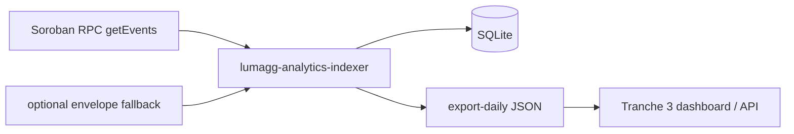

# Analytics Indexer (v0)

On-chain analytics for the LumAgg **aggregator contract** — Tranche 1 Deliverable 4.

## Scope

The indexer polls Soroban RPC **`getEvents`** for the aggregator contract, groups `swap` / `rt` / `leg` topics per `tx_hash`, and stores invocations in SQLite. Daily rollups export as JSON for Tranche 3 dashboard wiring.

**Vault path:** When arb uses `vault.execute_round_trip`, the aggregator still emits events via CPI — same indexer path as direct `round_trip_swap`.

**Legacy fallback:** `indexer.envelope_fallback = true` also ingests pre-upgrade txs and supplies token/path metadata for historical 4-field `leg` events. New compact `leg` events are self-contained. For old ledgers, the fallback can use `dex.horizon_url` when the configured Soroban RPC no longer returns the transaction envelope.

## Aggregator events (requires WASM upgrade)

After upgrading mainnet aggregator WASM, each successful invoke emits:

| Topic | When | Data fields |
|-------|------|-------------|
| `swap` | `swap()` completes | user, token_in, token_out, amount_in, amount_out, route_count |
| `rt` | `round_trip_swap()` completes | user, base, bridge, amount_in, amount_out, serial_depth, is_split |
| `leg` | each DEX hop | leg_index, dex_tag, pool, token_in, actual amount_in |

`dex_tag`: 0=aquarius, 1=soroswap, 2=phoenix, 3=sushi, 4=comet

Upgrade: `./contracts/aggregator/upgrade.sh` (see repo README).

## Architecture



1. **Ingest loop** — advance ledger cursor in batches (≤10k ledgers per RPC call).
2. **Parse events** — decode topic + value XDR; group legs by `tx_hash`.
3. **Store** — `swap_invocations` + `swap_legs`; idempotent on `tx_hash`.
4. **Export** — aggregate by UTC day.

## Volume attribution spec

| Field | Source | Notes |
|-------|--------|-------|
| **Function** | topic `swap` → `swap`; topic `rt` → `round_trip_swap` | |
| **User** | summary event field 0 | G-address or contract |
| **Entry notional** | summary event | Invocation input, grouped by entry token |
| **Routed volume** | `leg` event + envelope token metadata | Sum of each executed leg's actual input, grouped and priced by that leg's token |
| **Split swap** | `route_count > 1` on swap events; `is_split` on round-trip events | |
| **DEX attribution** | `leg` events | Successful, actually executed hops only |
| **Pool** | `leg` event pool address | |
| **Status** | `inSuccessfulContractCall` | default SUCCESS |

`by_token` remains the stable entry-notional breakdown consumed by DefiLlama.
Per-leg routed amounts use the separate `routed_by_token` field so intermediate
hop tokens cannot change external volume semantics.

## Round-trip surplus

For each successful `round_trip_swap`, the indexer derives:

`gross_surplus = amount_out - amount_in`

This is an on-chain execution result, grouped by base token and optionally priced
to historical daily USD by the API. It is **gross surplus, not net P&L**:
transaction fees are not present in aggregator events and are not deducted.
Failed transactions and bot simulation estimates are excluded.

## Configuration

The indexer reads the same `lumagg-aggregator.toml` as the API and worker.

| TOML key | Default | Description |
|----------|---------|-------------|
| `network.rpc_url` | required | Soroban RPC endpoint |
| `network.passphrase` | mainnet | Stellar network passphrase |
| `api.aggregator_contract` | required | Event source contract |
| `features.escrow_contract` | unset | Optional Order Escrow event source |
| `indexer.mode` | `events` | `events` \| `envelope` \| `both` |
| `indexer.envelope_fallback` | `false` | Ingest legacy envelopes and enrich historical leg events |
| `indexer.db_path` | `./data/analytics-indexer.db` | Shared SQLite file used by the indexer and API |
| `indexer.poll_secs` | `30` | Poll interval |
| `indexer.start_ledger` | unset | Initial ledger when the database has no cursor |
| `indexer.page_limit` | `10000` | `getEvents` page size |
| `dex.horizon_url` | public Horizon | Horizon fallback used for historical envelope repair |

## Commands

```bash
CONFIG=./lumagg-aggregator.toml

# Continuous ingest
./lumagg-analytics-indexer --config "$CONFIG" run

# One-shot backfill from ledger
./lumagg-analytics-indexer --config "$CONFIG" backfill --start-ledger 63200000

# Status
./lumagg-analytics-indexer --config "$CONFIG" status

# Daily JSON export
./lumagg-analytics-indexer --config "$CONFIG" export-daily
./lumagg-analytics-indexer --config "$CONFIG" export-daily 2026-06-01
```

## Tranche 3 handoff

- `export-daily` maps to planned dashboard cards.
- **`GET /api/v1/stats`** on api-server when `[indexer]` is configured (same DB file).

The daily JSON export also includes `round_trip_by_bridge`, an additive
breakdown of successful round trips by intermediary bridge token. Existing
`daily[].by_token[].amount_in` semantics are unchanged for external consumers
such as DefiLlama.
- Public UI: https://lumagg.xyz/stats
- Sample export: [sample-indexer-export.json](./sample-indexer-export.json)

```bash
curl -s https://api.lumagg.xyz/api/v1/stats | jq .
```

## Development

The development schema currently has no migration layer. After schema changes,
start from a fresh indexer SQLite file (back up any data you need first) and
backfill aggregator events.

For the compact `leg` rollout:

1. Upgrade the Aggregator WASM before disabling envelope fallback.
2. Backfill pre-upgrade ledgers with `indexer.envelope_fallback = true`.
3. Run the live indexer with `indexer.envelope_fallback = false`; new events already
   contain the input token and actual execution input.

```bash
cargo test -p analytics-indexer
cargo test -p aggregator-contract   # event emission in contract tests
```

Crate layout: `crates/analytics-indexer/` · RPC: `crates/dex-adapters/src/rpc/events.rs`
