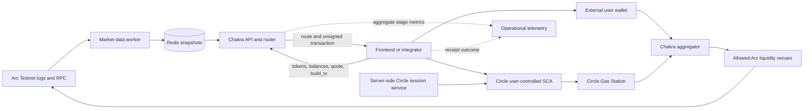
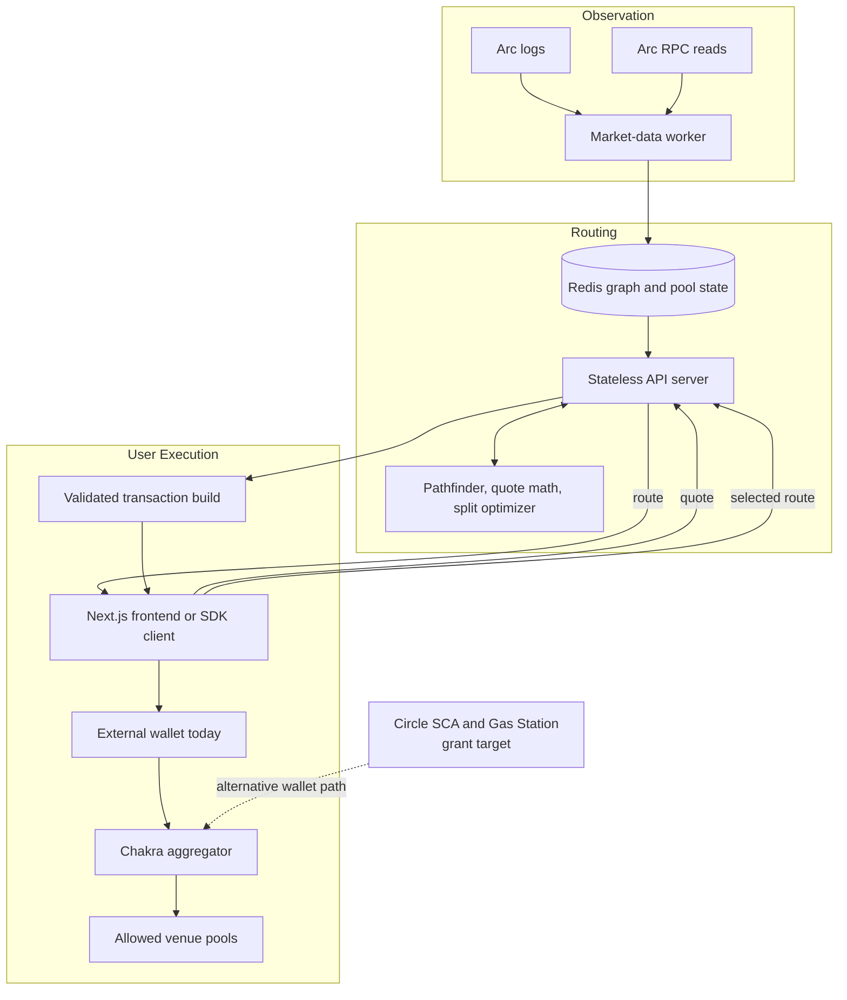

# Chakra Technical Architecture

**Product:** Chakra
**Network:** Arc Testnet
**Status:** Live proof of concept with grant-funded production-readiness roadmap
**Evidence checked:** September 4, 2026
**Repository:** [mangekyou-labs/chakra](https://github.com/mangekyou-labs/chakra)
**Grant proposal:** [Circle 2026 Cohort 2 Submit Proposal Workbook](grants/circle-developer-grant-proposal.md)

## Product Overview

Chakra is a non-custodial stablecoin routing service for Arc. It observes
supported decentralized exchange pools, compares executable routes, and gives a
wallet the information needed to submit a swap. On September 4, 2026 the live
API returned a canonical USDC→EURC→cirBTC route through the UnitFlow EURC/cirBTC
pool for the guarded 1-USDC probe (27 bps impact, 363 cirBTC atomic output).
Route availability and execution safety still depend on current market state.

The product is designed for two forms of use: an individual can use the Chakra
web application, while a wallet or payment application can integrate the REST
API or TypeScript SDK. The same routing and validation services support both
paths.

### What Is the Product?

Chakra combines six functions that an integrator would otherwise need to build
and operate separately:

1. Observe pool creation and state changes from Arc logs and RPC calls.
2. Maintain a current graph of supported tokens, pools, fees, and venue types.
3. Calculate candidate paths and expected output locally from verified pool
   state.
4. Compare single-path and, when sufficient liquidity exists, split routes.
5. Validate a selected route and encode a call to the Chakra aggregator
   contract.
6. Hand that transaction to a user-controlled wallet for authorization and
   submission.

Chakra is not an exchange, custodian, or liquidity provider. It does not take
possession of user funds, guarantee a route, or create liquidity. Its quote is
the best valid result found among the venues, pools, and token pairs supported
by the current deployment.

### Quote and Transaction-Building Interface

The public integration surface is intentionally small:

- `GET /api/v1/tokens` returns the supported token catalog.
- `GET /api/v1/balances` reads ERC-20 and native balances for an address.
- `GET /api/v1/quote` returns a route, expected output, minimum output, and
  explicit per-hop venue metadata.
- `POST /api/v1/build_tx` checks the route against the current snapshot and
  returns aggregator calldata, optional Permit2 typed data, and any required
  token approvals.
- `GET /api/v1/health` and `GET /api/v1/ready` expose service and market-state
  readiness.

Every response uses the same success/data/error envelope. The API returns
unsigned data and never accepts a private key. A wallet reviews and authorizes
the final action.

### Why Is This Needed Now?

Arc applications that exchange stablecoins need an executable price, not only a
list of pools. Each venue can differ in pool mathematics, fees, factory
registration, approval requirements, and swap calldata. Repeating that work in
every wallet or payment application slows integration and makes route-quality
and safety checks inconsistent.

Chakra provides a shared, open-source implementation while Arc's liquidity and
application ecosystem are developing. The testnet phase is also the appropriate
time to establish honest execution evidence, wallet integration, monitoring,
and security review before considering mainnet.

### What Value Does This Bring to the Arc and Circle Ecosystem?

#### For wallets and applications

- One quote and transaction-building interface instead of a separate adapter
  for every venue.
- Explicit pool, venue, fee, and factory data for review and display.
- A TypeScript SDK, OpenAPI contract, and self-host option.
- A planned embedded Circle Wallets path without removing external-wallet
  support.

#### For users

- A clear comparison among currently supported and healthy routes.
- User control over authorization and submission.
- Minimum-output and deadline protections encoded into the transaction.
- Planned fee sponsorship for eligible Circle smart-account transactions.

#### For liquidity venues

- A documented adapter model that can expose healthy pools to the router.
- Attribution in each route rather than an opaque source label.
- Additional eligible order flow when a venue offers the strongest executable
  route.

#### For Arc and Circle

- More practical utility for USDC and EURC as exchange and settlement assets.
- A stablecoin FX building block that other Arc applications can integrate.
- A concrete use of Arc settlement, Circle user-controlled wallets, and Circle
  Gas Station rather than a nominal product reference.

In summary, Chakra reduces repeated integration work while leaving transaction
authority with the user. Its value depends on accurate state, healthy liquidity,
and verifiable execution; the architecture does not assume those conditions are
always present.

## Routing and Transaction Safety Model

Chakra separates market observation, route calculation, transaction building,
and wallet authorization. No one service is trusted to perform all four tasks.

The worker is the only writer of the Redis market snapshot. API instances read
that snapshot, calculate candidate routes, and validate the chosen per-hop
identity again when building calldata. The wallet then checks and authorizes the
transaction. On-chain execution is limited to factories and venue paths allowed
by the aggregator contract.

### Explicit Route Disclosure

A route contains more than a display name. Each sub-route includes its token
path, pool addresses, venue types, fees, factories, input and expected output,
and allocation. Integrators consume those arrays directly instead of inferring
behavior from a human-readable source label.

This disclosure lets an application explain where a swap is expected to run and
lets `/build_tx` reject a route whose token pair, venue type, factory, or fee no
longer agrees with the current snapshot.

## Best Execution, Wallet Control by Default

"Best execution" in Chakra has a narrow meaning: the strongest valid output
found by the current router among supported, hydrated, and healthy candidate
routes for the requested amount and slippage. It is not a claim to cover every
Arc venue or guarantee the best price available anywhere on the network.

Wallet control means that quote and transaction construction do not authorize
movement of funds. The user reviews and approves any token allowance, Permit2
signature, and final swap transaction.

### Role Breakdown

- **User:** Chooses assets, amount, and slippage; reviews the route; authorizes
  the wallet action.
- **Integrator:** Presents Chakra data through a wallet, payment application, or
  exchange interface and handles the user experience around errors.
- **Chakra operator:** Runs the worker, Redis, API, and frontend; manages
  configuration and supported venue manifests; cannot sign user transactions.
- **Liquidity venue:** Supplies pools and on-chain swap execution under a
  supported adapter and allowlisted factory or router.
- **Circle:** Provides the planned user-controlled wallet and Gas Station
  services; Circle does not choose Chakra routes.

### Quote and Transaction-Building Interface

The route lifecycle is deliberately two-step:

1. `/quote` discovers and prices the route.
2. `/build_tx` validates the submitted route identity and prepares the exact
   transaction.

This boundary allows a user interface to display the route before asking for a
signature. It also prevents the frontend from constructing venue-specific
calldata on its own.

### Execution Control Points

#### Pre-transaction controls

- Validate the chain, token catalog, positive input amount, and distinct input
  and output assets.
- Exclude pools whose required state is missing or incomplete.
- Calculate minimum output from the selected slippage tolerance.
- Bind each step to its token pair, venue type, fee, pool, and allowed factory.
- Set an execution deadline and reject expired transaction requests.
- Return `value: 0` for the current ERC-20 aggregator flow.

#### Optional measures

- Permit2 typed-data authorization when a route requires it.
- Direct ERC-20 approval only when reported in `required_approvals`.
- Circle Gas Station sponsorship for eligible user-controlled smart-account
  transactions during the grant phase.
- Integrator-side limits on asset pairs, amount, slippage, and supported venues.

#### Post-transaction controls

- Track submitted transaction hash and receipt status without collecting
  signing material.
- Display the Arc explorer result to the user.
- Classify failures by route, wallet, sponsorship, RPC, revert, or confirmation
  stage.
- Feed aggregate reliability measurements into operational monitoring.

The controls make failures visible and constrain transaction construction, but
they do not remove smart-contract, venue, liquidity, RPC, wallet, or market
risk.

## Conclusion

Chakra's product model is a sequence of independently reviewable steps: observe,
quote, validate, authorize, and settle. The user remains the final authority,
while operators and integrators receive enough route detail to diagnose and
explain the result.

## Technical Architecture

The current deployment has a read-heavy API path and a single market-state
writer. Arc logs and RPC state enter through the market-data worker. The worker
publishes topology and per-pool records to Redis. Stateless API instances hydrate
candidate paths, calculate quotes locally, and build aggregator calldata. The
frontend or SDK passes that calldata to a wallet.

The Circle grant adds an alternative wallet adapter and a small server-side
session service. It does not replace the router API or give the API control of a
wallet. Circle credentials stay on the server, while the user-controlled smart
account remains responsible for authorization.

## Technical Implementation

| Component | Status | Responsibility |
| --- | --- | --- |
| Next.js frontend | Current | Asset selection, quote display, route review, external-wallet flow, and transaction status |
| TypeScript SDK | Current | Typed client for quote and transaction-build operations |
| Rust API server | Current | Validation, route calculation, balance reads, transaction construction, health, and readiness |
| Rust routing engine | Current | Candidate-path search, local pool mathematics, route comparison, and split optimization |
| Rust DEX adapters | Current | Pool discovery, state hydration, quote mathematics, and venue encoding |
| Market-data worker | Current | Arc log observation, RPC reads, discovery, and Redis snapshot publication |
| Redis | Current | Routing topology, pool state, factory metadata, and readiness source |
| Solidity aggregator | Current | Atomic wallet-submitted route execution across allowed venue steps |
| Permit2 integration | Current | Typed authorization where required by the selected route |
| External wallet adapter | Current | User authorization and submission through the existing browser-wallet path |
| Circle wallet-session service | Grant target | Server-side Circle user/session issuance without exposing API credentials to the browser |
| Circle user-controlled SCA adapter | Grant target | Email-OTP wallet creation or recovery and user-authorized Arc transactions |
| Circle Gas Station | Grant target | Policy-bound sponsorship for eligible Circle smart-account transactions |
| Telemetry and public report | Grant target | Aggregate quote, build, submission, confirmation, and sponsorship measurements |

### Market Data, Quote, and Wallet Interaction

Solid lines show product and transaction flows. Dotted lines show planned
aggregate operational measurements. Circle components are grant targets; the
current live frontend uses the external-wallet path.

## Terminology

| Term | Meaning in Chakra |
| --- | --- |
| Candidate path | A token and pool sequence considered by the router |
| Healthy route | A route whose required pool state is available and passes current validation |
| Best execution | The strongest valid output among Chakra's supported candidates, not the entire network |
| Sub-route | One independently allocated path within a quote |
| Split route | Two or more sub-routes sharing the input amount when this improves the valid result |
| Snapshot | The Redis-published graph and pool state read by API instances |
| Route identity | Token path, pools, venue types, fees, and factories used to validate transaction construction |
| Minimum output | The lowest accepted output after applying the user's slippage setting |
| Permit2 | Typed token authorization used by the aggregator when required |
| User-controlled SCA | A Circle smart contract account whose transaction remains subject to user authorization |
| Gas sponsorship | A policy-limited network fee paid through Circle Gas Station for an eligible transaction |

## User Roles

### User

The user selects a pair and amount, reviews the expected and minimum output,
chooses a wallet, and approves or rejects the final action. The user bears normal
market and smart-contract risk and must not interpret a testnet quote as a
guaranteed exchange rate.

### Integrator

An integrator uses the REST API or SDK, displays route and error information,
and decides which Chakra-supported assets and venues to expose. An integrator
can use the public service or operate a self-hosted instance.

### Chakra Operator

The operator manages RPC endpoints, worker and API availability, Redis,
deployment configuration, venue allowlists, monitoring, and incident response.
The operator cannot authorize a user's wallet transaction.

### Liquidity Venue Operator

A venue operator deploys and maintains pools. Inclusion in Chakra depends on a
supported adapter, allowed contract identity, complete market state, and useful
liquidity. Integration does not guarantee that a venue will appear in a route.

### Independent Reviewer

The reviewer examines contracts, transaction construction, authorization
boundaries, and operating assumptions. Critical and high-severity findings must
be resolved before Chakra can pass its mainnet gate.

## Integrator and Operator Capabilities

An integrator can:

- Retrieve the supported token catalog and balances.
- Request quotes with an amount and slippage tolerance.
- Display every route leg using explicit venue metadata.
- Build a transaction for an identified user address.
- Hand the result to an external wallet or the planned Circle wallet adapter.
- Self-host the Chakra services when operational control is required.

A Chakra operator can:

- Configure Arc RPC and WebSocket providers and monitored factories.
- Deploy the worker, API, Redis, frontend, and aggregator contract.
- Add only reviewed factory and venue coordinates to the supported manifest.
- Monitor readiness, snapshot health, route errors, and receipt outcomes.
- Pause promotion or deployment when liquidity, Circle services, RPC state, or
  security review does not meet the release gate.

Neither role can bypass user authorization or manufacture an on-chain receipt.

### End-to-End Quote and Settlement Flow

1. The user selects USDC, EURC, and an input amount.
2. The application requests a Chakra quote.
3. The API reads the current topology and pool state from Redis.
4. The router evaluates supported candidate paths and returns the strongest
   valid result with per-hop attribution.
5. The application displays expected output, minimum output, route, fees, and
   price impact.
6. After the user continues, the application sends the selected route and user
   address to `/api/v1/build_tx`.
7. The API revalidates route identity and returns calldata, deadline, optional
   Permit2 typed data, and required approvals.
8. The user authorizes the action in an external wallet or, after the grant
   integration, a Circle user-controlled SCA.
9. For an eligible Circle SCA transaction, Gas Station applies the configured
   sponsorship policy.
10. The wallet submits the transaction to Arc.
11. The aggregator executes the allowed venue steps and enforces minimum output
    atomically.
12. The application displays the confirmed receipt or a stage-specific error
    and records only aggregate operational measurements.

## Router Operating Model

### Quote Flow

1. The worker receives relevant Arc log events and periodically performs
   discovery and refresh calls.
2. It writes pool topology and type-specific state under the `chakra:` Redis
   namespace.
3. Incomplete concentrated-liquidity records are withheld from quotes until
   required tick coverage is available.
4. The API enumerates candidate paths for the requested pair.
5. It hydrates the necessary records and calculates expected output locally.
6. It compares valid single and split allocations and returns the strongest
   result found.

Redis record expiration is a cache-eviction mechanism, not a promise of quote
freshness. Readiness and grant-funded stale-state checks must fail safely when
the required market view is not usable.

### Transaction Flow

1. The application returns the selected sub-routes to `/build_tx`.
2. The API verifies token continuity, pool addresses, venue types, fees,
   factories, allocation, deadline, and minimum output.
3. The response identifies the Chakra aggregator, Arc chain ID, zero native
   value, calldata, optional Permit2 typed data, and direct approvals if needed.
4. The wallet obtains the user's authorization and submits to Arc.
5. The aggregator executes the route or reverts the transaction as a unit.
6. The wallet and application observe the receipt; the API does not submit on
   the user's behalf.

## Functional Scope

| Scope | Included |
| --- | --- |
| Current proof of concept | Arc Testnet; USDC, EURC, and cirBTC catalog; REST API; TypeScript SDK; web swap interface; worker and Redis state; supported pool mathematics; aggregator and Permit2; external-wallet transaction construction |
| Grant delivery | Confirmed swap evidence; route and UX hardening; telemetry; Circle user-controlled SCA; Gas Station; integration validation; independent security assessment; public close-out package |
| Conditional | Additional live routes, split execution, and cirBTC evidence when real healthy liquidity exists; mainnet deployment when network, Circle products, liquidity, and security gates are met |
| Excluded | Custody, private-key handling, artificial liquidity, guaranteed returns, order books, lending, cross-chain transfer, CCTP, Gateway, unsupported venues, and a fixed Arc mainnet date |

## Arc and Circle Integration

### Arc

Arc Testnet is Chakra's only active network. The runtime uses chain ID `5042002`
and publishes its RPC, explorer, token, pool, venue, and contract coordinates in
`docs/arc-testnet-manifest.json`. The market-data worker observes Arc, the
aggregator executes on Arc, and the wallet submits directly to Arc.

### Circle Assets

USDC and EURC are the target pair and remain healthy in the live readiness
probes. The September 4, 2026 live API also returned the canonical USDC→EURC→
cirBTC multihop through UnitFlow at 27 bps impact for the guarded 1-USDC probe.
cirBTC remains subject to the same route, reserve, and price-impact checks as
every other asset; asset inclusion is separate from route availability.

### Circle Wallets: Grant Target

The reference application will add a Circle user-controlled smart contract
account on `ARC-TESTNET`. Email one-time passcode authentication provides a
familiar entry path, but the user remains responsible for transaction approval.
A server-side session service holds the Circle API credential and issues only
the short-lived data required by the Circle client flow. It does not receive a
private key, one-time passcode, PIN, or signing secret.

The Circle wallet adapter consumes the same `to`, `data`, `chain_id`, `value`,
deadline, and authorization information returned by Chakra's existing
transaction builder. The router and public API do not gain a separate
Circle-specific quote format.

### Circle Gas Station: Grant Target

Gas Station sponsors eligible Circle smart-account network fees under a policy
configured by the Chakra operator. The policy will restrict supported network,
contract, transaction type, and spend. Sponsorship denial or service
unavailability is reported before submission where the Circle interface permits
it; the interface does not promise permanent free transactions.

### Products Not Included

CCTP and Gateway are not part of this grant scope. Chakra's immediate purpose is
route comparison and execution among Arc-native liquidity venues. Cross-chain
funding or unified balances would introduce a separate settlement lifecycle and
will be evaluated independently if a demonstrated integrator need emerges.

## PoC Implementation

The proof of concept is a deployed Arc Testnet system rather than a static
design. Its hosted API and frontend are publicly reachable, and the published
SDK implements quote and transaction-build requests. A controlled QA swap now
also provides confirmed end-to-end settlement and analytics attribution.

## PoC: Multi-Venue Stablecoin Routing on Arc Testnet

The implementation supports multiple pool models and venue adapters, but the
current live liquidity does not justify a broad execution claim. On September
4, 2026, the live snapshot exposed an executable USDC→EURC→cirBTC multihop via
Presto and UnitFlow. Chakra considers other paths only when their state is
complete and reserves are adequate for the requested amount.

This distinction matters: software support for split optimization or cirBTC is
not the same as a healthy live route. Test fixtures prove calculations and
validation behavior; only a confirmed public transaction proves end-to-end
execution.

## Current Phase Outcome

The current phase has delivered:

- A public Arc Testnet frontend and API.
- A published TypeScript SDK and OpenAPI contract.
- A worker-to-Redis-to-API market-data path.
- Recorded quote/build evidence plus a confirmed USDC-to-EURC-to-cirBTC QA route.
- A deployed aggregator contract with Permit2-aware transaction construction.
- Local, package, container, and hosted-service validation records.

It has not yet delivered Circle Wallets, Gas Station, an independent security
assessment, proven split execution on live liquidity, or mainnet readiness.

## PoC Architecture

## What Is Implemented

### Market state

- Pool topology and state are separated in Redis.
- The worker is the sole writer; API instances are readers.
- Type-specific records cover constant-product, stable-swap, and
  concentrated-liquidity state.
- Incomplete concentrated-liquidity state is excluded from quoting.

### Routing and API

- Candidate-path search and local quote calculation.
- Split optimization when more than one healthy candidate is available.
- Explicit per-hop venue metadata.
- Consistent response envelopes, rate limits, readiness, and common error
  codes.
- Revalidation of selected route identity during transaction construction.

### Execution and integration

- Solidity aggregator on Arc Testnet.
- Permit2 typed-data support and direct-approval reporting.
- Static Next.js interface and external-wallet integration.
- Published TypeScript SDK, examples, OpenAPI, and self-host guide.

### Deployment

- API, worker, and Redis hosted on Render.
- Frontend hosted on Vercel.
- Public manifest for testnet contracts, assets, pools, and venues.
- Documented release checks and current evidence limitations.

## PoC vs Production Differences

| Area | Current PoC | Production-readiness target |
| --- | --- | --- |
| Network | Arc Testnet only | Mainnet only after Arc, Circle, liquidity, and security gates are met |
| Wallets | External browser wallet; submission evidence incomplete | External wallet plus user-controlled Circle SCA with confirmed execution |
| Fees | User follows the current wallet fee path | Policy-bound Gas Station sponsorship for eligible Circle SCA transactions |
| Route evidence | One controlled USDC-to-EURC-to-cirBTC swap is confirmed; broader availability remains conditional | Confirmed swaps; additional routes reported only when live liquidity supports them |
| Reliability | Release checks and error responses | Stage-level telemetry, recovery UX, alerting, and public aggregate report |
| Security | Automated tests and internal review | Scoped independent assessment and remediation gate |
| Operations | Testnet deployment and manual evidence records | Documented monitoring, incident response, rollback, maintenance, and conditional launch checklist |

## Current PoC Constraints and Engineering Rationale

### Liquidity is an external input

Chakra cannot route through reserves that do not exist. The project therefore
reports only routes returned by the live snapshot and keeps artificial liquidity
out of traction claims. The September 4 probe demonstrated a healthy executable
cirBTC path, and the separately authorized QA transaction confirmed that route
end to end.

### Controlled QA execution

The controlled QA wallet submitted 1,000,000 atomic USDC through the canonical
USDC→EURC→cirBTC route. Receipt
`0x2df6e81aa9ff0805aad7d49241ccdd9e979dd7c0dae1b261c51ed469542236c5` confirmed
in block `60438104`; live stats recorded the swap with Presto and UnitFlow
attribution after the confirmation window. This is controlled QA evidence,
not organic user traction.

### Market-state quality is more important than route count

A large pool catalog is not useful if state is incomplete or stale. Chakra
excludes records that lack required data and will add explicit stale-state tests
instead of prioritizing unsupported venue count.

### The hosted API is convenient, not mandatory

Render and Vercel simplify public testing, but the project remains self-hostable.
Integrators that require their own RPC, availability policy, or operating
controls can run the worker, Redis, API, and frontend themselves.

### Operator authority is bounded but material

The operator controls deployment configuration and allowed venue coordinates.
This cannot authorize user funds, but a configuration error can affect which
routes are considered. Manifests, allowlists, transaction validation, monitoring,
and independent review reduce that risk.

### Circle services remain external dependencies

Wallet creation, session issuance, and fee sponsorship depend on Circle's
supported interfaces and policies. Chakra will provide explicit failure states
and retain its external-wallet path. Product availability and testnet limits
must be checked again before release.

### Mainnet has no fixed date in this document

The proof of concept is intentionally testnet-only. Production deployment is a
conditional decision after network availability, suitable liquidity, Circle
product support, independent security review, and operational readiness are all
confirmed.

## Conclusion

Chakra provides a focused Arc routing layer: observe supported liquidity,
calculate and disclose an executable route, validate transaction construction,
and let the user authorize settlement. The existing proof of concept establishes
the data, routing, API, SDK, frontend, and contract foundation. The proposed
Circle grant closes the remaining execution-evidence gap, adds a meaningful
user-controlled Circle Wallets and Gas Station path, and creates the security
and operational evidence needed for a responsible launch decision.

## Reference Sources

- [Circle Developer Grants](https://www.circle.com/grant)
- [Circle Wallets supported blockchains](https://developers.circle.com/wallets/supported-blockchains)
- [Circle user-controlled wallet application guide](https://developers.circle.com/wallets/user-controlled/build-a-wallet-app)
- [Circle Gas Station policy management](https://developers.circle.com/wallets/gas-station/policy-management)
- [Circle Gas Station contract addresses](https://developers.circle.com/wallets/gas-station/contract-addresses)
- [Reference architecture template](https://docs.google.com/document/d/1QQIwHUW7STcGb6zMvT4IEP5PMIwlGIvzYUkeihynAfM/edit?usp=sharing)

Circle product availability, addresses, limits, and terms must be reconfirmed
before a production release.
